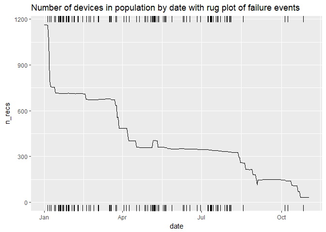
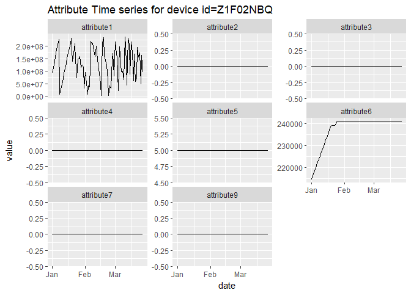
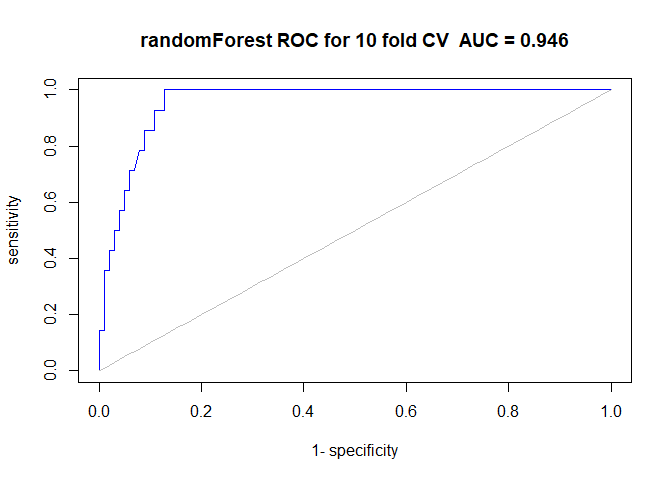
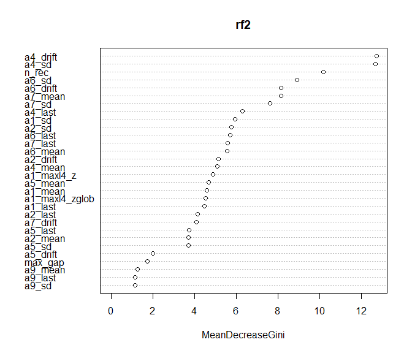
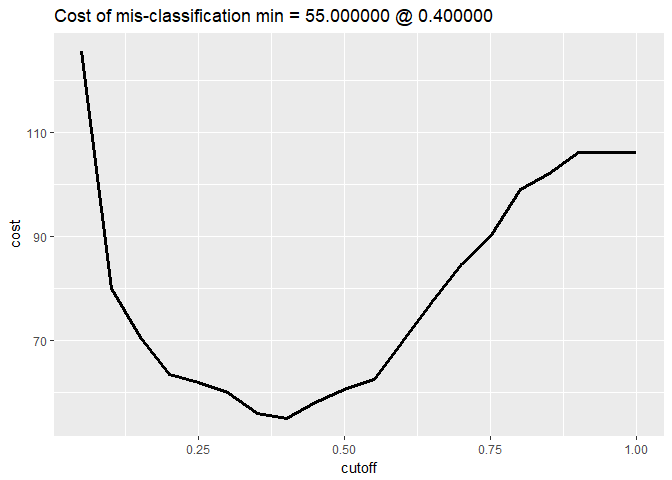

# Device Failure Analysis
Sujal Padhiyar 


# Overview

This document summarizes an analysis performed on an exercise surrounding a  [device_failure.csv] dataset. I will review the dataset, some exploratory data analysis, modeling and results of the analysis in a manner that might be typical of a work product. I have also created a companion document, [Device Failure Analysis - notebook](https://github.com/dsdaveh/device-failure-analysis/blob/master/device_failure.md), that is intended to be a lab notebook documenting the entire thought process throughout the analysis, and has more extensive R code and model results. 

We have the following minimal background:

> The dataset represents log activity from a fleet of devices transmitting daily aggregated telemetry attributes.  

> Predictive maintenance techniques are designed to help determine the condition of in-service equipment in order to predict when maintenance should be performed. This approach promises cost savings over routine or time-based preventive maintenance, because tasks are performed only when warranted. You are tasked with building a predictive model using machine learning to predict the probability of a device failure. When building this model, be sure to minimize false positives and false negatives. The column you are trying to predict is called failure with binary value 0 for non-failure and 1 for failure. 

# Exploratory Data Analysis

Here is a peak at the first and last few rows of the table.


```r
data <- fread('device_failure.csv')
data[ , date := ymd(date)]
bind_rows(head(data, 3), tail(data, 3))
```

```
##          date   device failure attribute1 attribute2 attribute3 attribute4
## 1: 2015-01-01 S1F01085       0  215630672         56          0         52
## 2: 2015-01-01 S1F0166B       0   61370680          0          3          0
## 3: 2015-01-01 S1F01E6Y       0  173295968          0          0          0
## 4: 2015-11-02 Z1F0QK05       0   19029120       4832          0          0
## 5: 2015-11-02 Z1F0QL3N       0  226953408          0          0          0
## 6: 2015-11-02 Z1F0QLC1       0   17572840          0          0          0
##    attribute5 attribute6 attribute7 attribute8 attribute9
## 1:          6     407438          0          0          7
## 2:          6     403174          0          0          0
## 3:         12     237394          0          0          0
## 4:         11     350410          0          0          0
## 5:         12     358980          0          0          0
## 6:         10     351431          0          0          0
```

We've got a dataset with 124494 rows that is a collection of aggregated daily logs for devices with a failure indicator (the target) and unidentified attributes associated with each log entry. The date range of the data goes from January to November of 2015.  The visualization below shows the number of devices for each day in the log file.  As we can see, its decreasing over time, representing a shrinking of the device population as time proceeds. The 'rug' ticks at the top and bottom of the plot indicate failure events.


```r
fails <- data %>% filter(failure == 1)
data %>% group_by(date) %>%
    summarize(n_fails = sum(failure),
              n_recs = n()) %>%
    mutate( cum_fails = cumsum(n_fails)) %>%
    ggplot(aes(date, n_recs)) + geom_line() + 
    geom_rug(data = fails, aes(date, y=1), sides = 'tb', position = "jitter") +
    ggtitle('Number of devices in population by date with rug plot of failure events')
```

<!-- -->


There's some important information here. The big drop off in devices that happens in day 5 and 6 are not attributable to a corresponding surge in failures. This is the first clue that we'll need analyze this data at the device grain rather than the given device/day grain. 

Over 400 function devices are taken from the log in the first 5-6 days. The first failure doesn't occur until day 5. If we want to look at device history prior to removal, we have to consider a large portion of our training examples will only have a few days worth of data.


## Failure


```r
n_devices <- length(unique( data$device))
survived <- data[date == max(date), unique(device)]
n_fails <- data[, sum(failure)]
pct_removed <- percent( 1 - length(survived) / n_devices)
pct_fails_log <- percent( n_fails / nrow(data))
pct_fail_rm <- percent( n_fails / (n_devices - length(survived)) )
```

Failure is the target variable.  Most the devices are removed from the log at some point, but the ratio of failures in the log file are extrmely small (0.09%), because devices report success until they fail.  Modeling at this level would give us extreme class imbalance and would assume independence between observations which is probably not the case.  I.e. devices likely fail slowly with a data signal that would be missed without looking at multiple days in sequence.

There are 1168 unique devices in the data, and only 106 (9.32%) are removed for failure.  While most drives are removed on the day failure is indicated, a few do not (see the plot below).   


```r
# devices that have a non-failing last log entry (excluding those that survive the entire time)
fail_agg <- data %>% group_by(device) %>% arrange(date) %>%
    summarize(n_fails = sum(failure),
              last_date = max(date),
              last_fail = failure[n()] == 1) %>%
    filter(n_fails > 0)

# double check that devices can only fail once
# max(fail_agg$n_fails) == 1  # TRUE

# percent of failures that happened on the last log entry
#percent(sum(fail_agg$last_fail) / nrow(fail_agg)) # TRUE


zombies <- fail_agg %>% filter(! last_fail) %>% select(device) %>% .[[1]]
data %>% filter(device %in% zombies) %>%
    mutate(device = as.factor(device)) %>%
    ggplot(aes(x=date, y=device, height=failure * .5, group=device)) + #geom_line()  
    geom_ridgeline(alpha = .6, fill='skyblue')
```

<!-- -->

## Attributes 1-9

The attributes are all integers, but many have the appearance of being error codes, with a large percentage of 0 values and large gaps between frequent occurances.  This is common with devices that may have error codes that are bit encoded (eg. 2,4,8,16...1024, etc.).  In a real world analysis, attempting to learn more about the meaning of the error codes  that may be well documented, might help to develop categorical variables with more predictive power than treating the attributes as integer.

See the accompanying lab notebook for density plots that help describe the distributions. Below is a table of summary values for each attribute. A few observations:

+ 6 attributes have very high percentage of zero values.  These could be error codes or some other indicator  
+ many of the attributes are heavily skewed.  These should be transformed for some analyses although this wasn't necessary for my models.
+ attributes 7 and 8 are identical, so I removed attribute8 from the model.


```r
asummary <- tibble(name = paste0('attribute', 1:9))
attr_only <- data %>% select(starts_with('attr'))
asummary$n_unique <- map_int( attr_only, function(.x) length(unique(.x)))
asummary$pct_zero <- percent(map_dbl( attr_only, function(.x) mean(.x == 0)))
asummary$range <- map_chr( attr_only, function(.x) paste(range(.x), collapse = ', '))
asummary$range2 <- map_chr( attr_only, function(.x) paste(range(.x[.x != 0]), collapse = ', '))
asummary$mean <- map_dbl( attr_only, mean)
asummary$median <- map_dbl( attr_only, median)
asummary$sd <- map_dbl( attr_only, sd)
rm(attr_only)
kable(asummary)
```


name          n_unique   pct_zero  range          range2                     mean        median             sd
-----------  ---------  ---------  -------------  ----------------  -------------  ------------  -------------
attribute1      123878      0.01%  0, 244140480   2048, 244140480    1.223868e+08   122795744.0   7.045960e+07
attribute2         558     94.87%  0, 64968       8, 64968           1.594848e+02           0.0   2.179658e+03
attribute3          47     92.66%  0, 24929       1, 24929           9.940455e+00           0.0   1.857473e+02
attribute4         115     92.50%  0, 1666        1, 1666            1.741120e+00           0.0   2.290851e+01
attribute5          60      0.00%  1, 98          1, 98              1.422269e+01          10.0   1.594302e+01
attribute6       44838      0.00%  8, 689161      8, 689161          2.601729e+05      249799.5   9.915101e+04
attribute7          28     98.83%  0, 832         6, 832             2.925282e-01           0.0   7.436924e+00
attribute8          28     98.83%  0, 832         6, 832             2.925282e-01           0.0   7.436924e+00
attribute9          65     78.20%  0, 18701       1, 18701           1.245152e+01           0.0   1.914256e+02

```r
data$attribute8 <- NULL
```

# EDA Device Time Series 

By transforming the dataset at the device grain, we have have a 9.08% failure rate, which is still imbalanced, but not problematically so. The strategy assumes sudden changes in the attribute measures will be indicative of failure, so a model will look at metrics just prior to the last day of record in order to see if that gives us insight into which were removed due to failure.  We can also add metrics to compare operating values with prior values for devices that have been in service for longer periods.

To verify this intuition, I created a few visualization of attribute time series 

First as a single, arbitrarily selected device:


```r
dev_rec <- data %>% group_by(device) %>% 
    summarize( n = n(),
               failure = as.factor(max(failure)),
               rdate = max(date)) %>%
    arrange(n)
d1 <- rev(dev_rec$device)[500]  # pull one out of the middle so its not too short lived

data %>% filter(device == d1) %>% 
    gather(attr, value, starts_with('attr')) %>%
    ggplot(aes(date, value)) + geom_line()  +
    facet_wrap(~ attr, scales = 'free_y') +
    ggtitle(sprintf('Attribute Time series for device id=%s', d1))
```

<!-- -->

Now again with multiple devices overlapped.  Again, the devices are arbitrarily chosen, however the devices beginning with *Z* are failures, while the others are not. 


```r
d4 <- rev(dev_rec$device)[seq(550, 700, 50)]  # 
d4_rdate <- dev_rec[dev_rec$device == d4[1], ]$rdate
# use names startig with Z just so they are easier to pick out in the plot
dfail <- dev_rec %>% filter(failure == 1, rdate > d4_rdate, grepl('^Z', device)) %>% first() #%>% first()
dfail <- dfail[1:2]  # cause dplyr::first is broken
data %>% filter(device %in% c(d4, dfail)) %>%  
    gather(attr, value, starts_with('attr')) %>%
    ggplot(aes(date, value, col=device)) + geom_line()  +
    facet_wrap(~ attr, scales = 'free_y')
```

<!-- -->

There is a lot of differentiation between the failures, although they span different attributes, which supports the strategy that looking for changes to baseline operation metrics should be a good indicator of failure.  

# Data Transformation / Feature Engineering

Here I create the transformed dataset.  Each device gets multiple features for each variable.  In general I included the mean and standard deviation for the entire device life as well as the last value and difference between first and last values (drift).  Attribute1 was also given the max Z score for the last 4 days.  I also recorded the total number of records for a device (a proxy for service life), and the maximum gap between log entries.

Note that the retirement data and the number of total failures for the 5 days prior are also calculated, but they were not used in the model.


```r
glast <- function(x, n) { 
    n <- min(length(x), n)
    rev(x)[1:n] %>% rev() 
}
glast_z <- function(x, n, xm = mean(x), xsd = sd(x)) {
    (glast(x, n) - xm) / xsd
}
max_abs_val <- function(x) x[which.max(abs(x))]

a1g_mean <- asummary[1,]$mean
a1g_sd <- asummary[1,]$sd
build_fea <- function(df) {
    n5d_fail <- df %>% group_by(date) %>% 
        summarize( nf = sum(failure == 1)) %>%
        mutate( n5d_fails = 
                    lag(nf, 1,def=0) + 
                    lag(nf, 2,def=0) + 
                    lag(nf, 3,def=0) + 
                    lag(nf, 4,def=0) +
                    lag(nf, 5,def=0) ) %>%
        select(rdate = date, n5d_fails)

    dev_fea <- df %>% group_by(device) %>% arrange(date) %>%
        summarise( failure = max(failure),
                   n_rec = n(),
                   max_gap = as.integer(max(diff(date))),
                   rdate = max(date),
                   a1_mean = mean(attribute1),
                   a1_sd = sd(attribute1),
                   a1_maxl4_z = max_abs_val( glast_z( attribute1, 4)),
                   a1_maxl4_zglob = max_abs_val( glast_z( attribute1, 4, 
                                                          xm = a1g_mean, 
                                                          xsd = a1g_sd) ),
                   a1_last = glast(attribute1, 1),
                   
                   a2_mean = mean(attribute2),
                   a2_sd = sd(attribute2),
                   a2_last = glast(attribute2, 1),
                   a2_drift = attribute2[1] - glast(attribute2, 1),
                   
                   a3_mean = mean(attribute3),
                   a3_sd = sd(attribute3),
                   a3_last = glast(attribute3, 1),
                   a3_drift = attribute3[1] - glast(attribute3, 1),
                   
                   a4_mean = mean(attribute4),
                   a4_sd = sd(attribute4),
                   a4_last = glast(attribute4, 1),
                   a4_drift = attribute4[1] - glast(attribute4, 1),

                   a5_mean = mean(attribute5),
                   a5_sd = sd(attribute5),
                   a5_last = glast(attribute5, 1),
                   a5_drift = attribute5[1] - glast(attribute5, 1),
                   
                   a6_mean = mean(attribute6),
                   a6_sd = sd(attribute6),
                   a6_last = glast(attribute6, 1),
                   a6_drift = attribute6[1] - glast(attribute6, 1),
                   
                   a7_mean = mean(attribute7),
                   a7_sd = sd(attribute7),
                   a7_last = glast(attribute7, 1),
                   a7_drift = attribute7[1] - glast(attribute7, 1),
                   
                   a9_mean = mean(attribute9),
                   a9_sd = sd(attribute9),
                   a9_last = glast(attribute9, 1),
                   a9_drift = attribute9[1] - glast(attribute9, 1) 
        )  %>%
        left_join(n5d_fail, by = 'rdate')
}
```

# Models

To build a model, I ran Random Forest (randomForest package) on the new dataset using 10 fold cross validation.  I evaluate the model using the CV predictions.


```r
set.seed(9)
trn <- build_fea(data) %>% sample_frac()

kfold <- 10
trn <- trn %>% mutate( 
    failure = as.factor(failure),
    fold = row_number() %% kfold + 1 )

get_formula <- function(x) {
    fea_names <- sort(names(x)[grepl('^a[0-9]', names(x))])
    as.formula(sprintf('failure ~ n_rec + max_gap + %s', paste(fea_names, collapse = ' + ')))
}

trn$pred_fail <- factor(NA, levels = levels(trn$failure))
trn$pred_prob <- -1.

trn <- data.table(trn)

rf2_cv <- list()
for (i in 1:kfold) {

    rf2 <- randomForest(get_formula(trn), trn[fold != i])
    rf2.trn_roc <- roc(rf2$votes[,2], trn[fold != i, failure])
    #plot(rf2.trn_roc, main=sprintf('ROC fold=%d', i))

    rf2.val <- predict(rf2, newdata = trn[fold == i], type = 'vote', norm.votes = TRUE)
    trn[fold == i, pred_prob := rf2.val[,2]] 
    trn[fold == i, pred_fail := predict(rf2, newdata = trn[fold == i])] 
    rf2.val_roc <- roc(rf2.val[,2], trn[fold == i, failure])
    #plot(rf2.val_roc, add=TRUE, col='blue')

    cat(sprintf('fold=%d  AUC: trn= %4.2f val= %4.2f\n', i, auc(rf2.trn_roc), auc(rf2.val_roc)))
    rf2_cv[[i]] <- rf2
}
```

```
## fold=1  AUC: trn= 0.94 val= 0.96
## fold=2  AUC: trn= 0.94 val= 0.99
## fold=3  AUC: trn= 0.94 val= 0.97
## fold=4  AUC: trn= 0.95 val= 0.88
## fold=5  AUC: trn= 0.94 val= 0.97
## fold=6  AUC: trn= 0.94 val= 0.96
## fold=7  AUC: trn= 0.94 val= 0.97
## fold=8  AUC: trn= 0.95 val= 0.91
## fold=9  AUC: trn= 0.94 val= 0.92
## fold=10  AUC: trn= 0.94 val= 0.96
```

Here's the ROC plot for the results


```r
rf2.roc <- roc(trn$pred_prob, trn$failure)
plot(rf2.val_roc, col='blue', main = sprintf('randomForest ROC for %d fold CV  AUC = %5.3f', kfold, auc(rf2.roc)) )
```

<!-- -->

AUC is the primary evaluation metric since I don't have any information to weight the cost of false positives (unnecessary inspection) and false negatives (failure in the field).  Since those probably aren't equivalent, its prudent to plot other evaluation metrics as a function of the cutoff.


```r
metrics <- data.frame()  #HACK: global for the markdown extraction
plot_metrics <- function(probs, truth, auc_score) {
    metrics <<- data.frame()
    for (cut in seq_len(20) * .05) {
        pred_cut <- factor(ifelse( probs >= cut, 1, 0))
        
        cm <- table(pred_cut, truth)
        if (nrow(cm) == 2) {
            cm_precision <- cm[2,2] / sum(cm[2,]) 
            cm_recall <- cm[2,2] / sum(cm[ ,2])
            cm_accuracy <- (cm[1,1] + cm[2,2]) / sum(cm)
            cm_f1 <- 2 * cm_precision * cm_recall / (cm_precision + cm_recall)
            metrics <<- rbind(metrics, 
                                 data.frame(cutoff = cut, 
                                            precision = percent(cm_precision), 
                                            recall = percent(cm_recall), 
                                            accuracy = percent(cm_accuracy), 
                                            F1 = percent(cm_f1),
                                            auc = percent(auc_score)))
        }
        
    }
    metrics %>% gather(metric, value, -cutoff) %>%
        ggplot(aes(cutoff, value, col = metric)) + 
        geom_line(size=1.3) +
        annotate('text', x=0.1, y=auc_score, label='AUC', vjust = -0.6)
}
plot_metrics(trn$pred_prob, trn$failure, auc(rf2.roc)) +
    ggtitle(sprintf('CV Metrics for RandomForest AUC = %5.3f', auc(rf2.roc)))
```

<!-- -->


```r
table(trn$pred_fail, trn$failure)
```

```
##    
##        0    1
##   0 1045   52
##   1   17   54
```

This model catches about half the cases using a cutoff of 0.5 (50.94% to be exact)


```r
rf2_imp <- importance(rf2)
varImpPlot(rf2,type=2)
```

<!-- -->

Drift for attribute 4 was almost always the primary indicator of failure across all folds and models. After that n_rec and and variance for attributes 6 and 7 were also important, but switched rank between the different folds/models. 

Additional models were also explored and their results are presented in the [accompanying lab-style notebook]((https://github.com/dsdaveh/device-failure-analysis/blob/master/device_failure.md)).

Some observations from this phase:

+ H2O GBM, Random Forest and R randomForest all performed similarly
+ There's not enough data to train a DL model with any efficacy
+ GLM might perform reasonably on this model, but more rigourous variable selection/transformation will be required

## Further Analysis

Let's assume we learned that cost of device failure was half the cost of device maintenance.  That changes the cutoff value we use.


```r
min_cost <- list(cost = Inf, cutoff = -1, cm = NULL)  #HACK: global for the markdown extraction
plot_cost <- function(probs, truth, fp_cost = 1, fn_cost = fp_cost) {
    cost <- data.frame()
    for (cut in seq_len(20) * .05) {
        pred_cut <- factor(ifelse( probs >= cut, 1, 0))
        
        cm <- table(pred_cut, truth)
        cut_cost <- cm[1,2] * fp_cost 
        if (nrow(cm) == 2) {
            cut_cost <- cut_cost + cm[2,1] * fn_cost  
        }
        cost <- rbind(cost, data.frame(cutoff = cut, cost = cut_cost))
        if (cut_cost < min_cost$cost) {
            min_cost$cost <<- cut_cost
            min_cost$cutoff <<- cut
            min_cost$cm <<- cm
        }
    }
    ix_min <- which.min(cost$cost)
    cost %>% 
        ggplot(aes(cutoff, cost)) + 
        geom_line(size=1.3) +
        ggtitle(sprintf('Cost of mis-classification min = %f @ %f', 
                        cost$cost[ix_min], cost$cutoff[ix_min]))
    }
plot_cost(trn$pred_prob, trn$failure, fn_cost = .5)
```

<!-- -->


```r
print(min_cost$cm)
```

```
##         truth
## pred_cut    0    1
##        0 1036   42
##        1   26   64
```

So now we see the optimum cutoff point is 0.4 which means we predict pending failure for more drives (compared to a cutoff at 0.5), but don't reduce the cutoff too drastically since avoiding unnecessary maintenance is still a driver of cost reduction.

# Conclusion

We've completed an introductory analysis, and without too much work, can reliably predict about half the failures before they occur, assuming our data is representative of true field logs. With more data, we might be able to make better predictions, and could incorporate other techniques such as neural networks into the analysis. With more information on the cost of false negative/positives, we could also try updating a GBM model with a custom objective function to further optimize the training. In the real world, we might spend some research time digging into some of the attribute values to see if encoding specific values might also give lift to the model. As it stands, the model informs us on the most important attributes, and could lead to a productive discussion with the stakeholders and business subject matter experts that would help identify the next logical steps.
